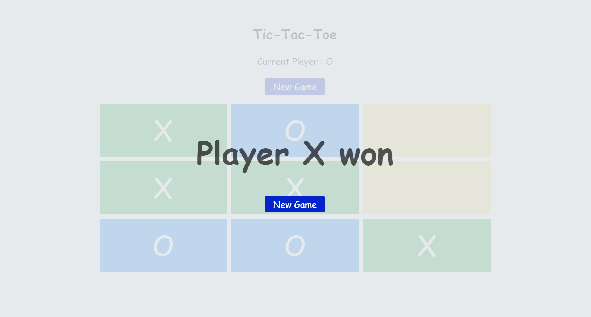

# TicTacToe

Tic-Tac-Toe is a game played between two players on a 3×3 board. The two players take turns to put pieces on the board. A single piece is put for each turn and piece once put does not move. A player wins the game by first lining three of his or her pieces in a straight line, no matter horizontal, vertical or diagonal.

## Development server

Run `ng serve` for a dev server. Navigate to `http://localhost:4200/`. The app will automatically reload if you change any of the source files.

## Code scaffolding

Run `ng generate component component-name` to generate a new component. You can also use `ng generate directive|pipe|service|class|guard|interface|enum|module`.

## Build

Run `ng build` to build the project. The build artifacts will be stored in the `dist/` directory. Use the `--prod` flag for a production build.

## Screenshots

Please find below some of the screenshots of the application

## Code coverage report

Please find below the code coverage report generated by karma

